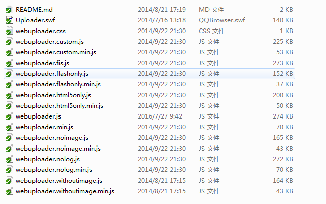

# 前端组件列表

    前后端标准组件列表

## 前端类
### 日历选择
	
◆my97DatePicker

    第三组件日历
>[代码引用](http://static.huizecdn.com/js/plugins/my97DatePicker/4.8/calendar.js "查看文档") http://static.huizecdn.com/js/plugins/my97DatePicker/4.8/calendar.js

    官方组件
>[查看文档](http://www.my97.net/ "查看文档") http://www.my97.net/

★my-calendar
>[代码引用](http://static.huizecdn.com/js/plugins/my-calendar/build/my-calendar.min.js "代码引用") http://static.huizecdn.com/js/plugins/my-calendar/build/my-calendar.min.js
>
>[查看文档](http://static.huizecdn.com/js/plugins/my-calendar/calendar.html "查看文档") http://static.huizecdn.com/js/plugins/my-calendar/calendar.html

### 上传
◆webuploader

    百度上传组件
>[代码引用](http://static.huizecdn.com/js/plugins/webuploader/webuploader.js) http://static.huizecdn.com/js/plugins/webuploader/webuploader.js

>[flash版 ](http://static.huizecdn.com/js/plugins/webuploader/Uploader.swf) http://static.huizecdn.com/js/plugins/webuploader/Uploader.swf

>[only html5](http://static.huizecdn.com/js/plugins/webuploader/webuploader.html5only.min.js) http://static.huizecdn.com/js/plugins/webuploader/webuploader.html5only.min.js

>[only flash ](http://static.huizecdn.com/js/plugins/webuploader/webuploader.flashonly.min.js) http://static.huizecdn.com/js/plugins/webuploader/webuploader.flashonly.min.js

>[css ](http://static.huizecdn.com/js/plugins/webuploader/webuploader.css)

>[查看文档](http://fex.baidu.com/webuploader/ "查看文档") http://fex.baidu.com/webuploader/

>目录结构

>

	

----------
## 兼容HTML5
### ★placeholder
    输入框默认文字提示
>[代码引用](http://static.huizecdn.com/js/plugins/placeholder/build/jquery-placeholder.js "代码引用") http://static.huizecdn.com/js/plugins/placeholder/build/jquery-placeholder.js

>[查看文档](http://static.huizecdn.com/js/plugins/placeholder/demo/ "查看文档") http://static.huizecdn.com/js/plugins/placeholder/demo/

### ★本地存储

    实现本地存储，兼容IE低版本，IE低版本使用userdata或cookie实现
>[代码引用](http://static.huizecdn.com/js/plugins/local-storage/local-storage.js "代码引用") http://static.huizecdn.com/js/plugins/local-storage/local-storage.js

>[查看文档](http://static.huizecdn.com/js/plugins/local-storage/readme.md "查看文档") http://static.huizecdn.com/js/plugins/local-storage/readme.md
### history

    历史记录插件，实现Ajax操作前进，后退操作
>[代码引用](src "代码引用")

>[查看文档](src "查看文档")
>
>目录结构

>http://static.huizecdn.com/js/plugins/history/
>
>
    
### ★发送信息等待
>[代码引用](http://static.huizecdn.com/js/plugins/send-message/send-message.js "代码引用") http://static.huizecdn.com/js/plugins/send-message/send-message.js

>[查看文档](http://static.huizecdn.com/js/plugins/send-message/html/demo.html "查看文档") http://static.huizecdn.com/js/plugins/send-message/html/demo.html

>[代码引用](src "代码引用")

>[查看文档](src "查看文档")

>[代码引用](src "代码引用")

>[查看文档](src "查看文档")

## 第三方jQuery Plugins
多级菜单jquery-menu-aim

	多级菜单功能，优化用户操作体验，如：正常上下操作与一般组件无异，如果倾斜操作则延迟显示
>[代码引用](src "代码引用")

>[查看文档](https://github.com/kamens/jQuery-menu-aim "查看文档") https://github.com/kamens/jQuery-menu-aim

### 
>[代码引用](src "代码引用")

>[查看文档](src "查看文档")

>[代码引用](src "代码引用")

>[查看文档](src "查看文档")

>[代码引用](src "代码引用")

>[查看文档](src "查看文档")

 

>查看文档
### 图片轮播
### history
### 
## 偏后端类

