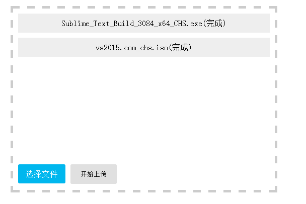

# 可分片、可续传的文件上传组件 WebUploader

官网：[http://fex.baidu.com/webuploader/](http://fex.baidu.com/webuploader/ "")

## 1. 主要功能
> * 多文件上传
> * 文件分片上传，提高并发速度
> * 分片传输失败，只需要重传失败的片
> * 现代浏览器支持拖拽，粘贴操作



## 2.使用方法

### A. 前端部分


引入js、css文件，另外组件还依赖jquery
```html
<link rel="stylesheet" type="text/css" href="http://res.hzins.com/web/public/webuploader/webuploader.css">
<script type="text/javascript" src="http://res.hzins.com/long/public/framework/jquery/jquery-1.8.3.min.js"></script>
<script type="text/javascript" src="http://res.hzins.com/web/public/webuploader/webuploader.js"></script>
```

html内容
```html
<div id="uploader" class="uploader">
    <ul id="file-list">
    </ul>

    <div class="btns">
        <span id="picker">选择文件</span>
        <button id="doUplaod">开始上传</button>
    </div>
</div>
```

实例化上传对象，并做相应设置，注意flash 和server路径不能域名

```javascript
<script type="text/javascript">
// uploader配置
var uploader = WebUploader.create({
    swf: '/web/public/Uploader.swf', // 跨域无效？
    server: '/upload',
    pick: '#picker', // 选择文件的按钮。可选。内部根据当前运行是创建，可能是input元素，也可能是flash.
    resize: false,// 不压缩image, 默认如果是jpeg，文件上传前会压缩一把再上传！
    chunked: true, // 是否分片
    chunkSize: 52428*100, // 分片大小， 5M

    dnd: '#uploader' // 拖拽
});

// 点击上传
$('body').on('click', '#doUplaod', function () {
    gChecked = false;
    uploader.upload();
})
</script>
```


完成这些设置后，点击相应选择文件并上传，将会向后台提交 "multipart/form-data" 类型的表单数据，抓包如下


（待完善）


### B. 后台部分
上传组件向后台提交"multipart/form-data" 类型的表单数据，

数据除了包含一般文件信息和文件数据外，还附带 chunk 和 chunks，表明当前分片编号以及总分片数量

服务器程序可通过这两个参数，进行续传相关操作

（待完善）


这里是一个php实现分片接收、合并的示例

这里是一个nodejs实现的示例

（待完善）


## 3. 续传、秒传的实现


